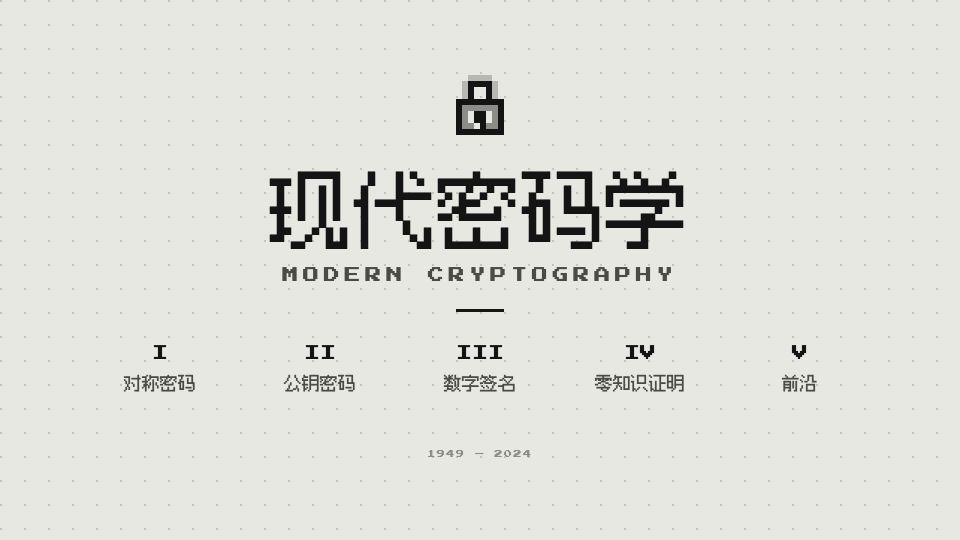
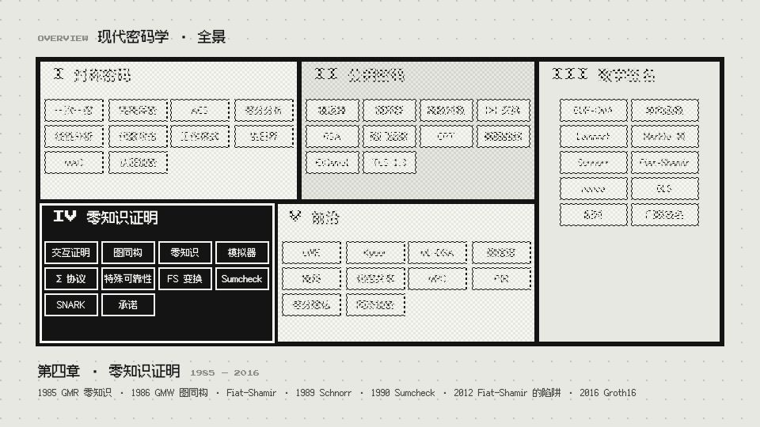
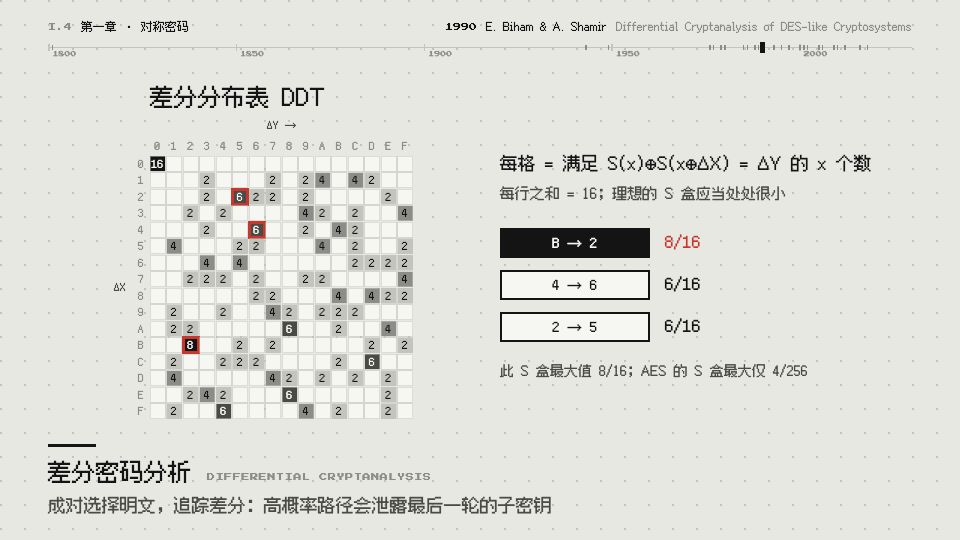
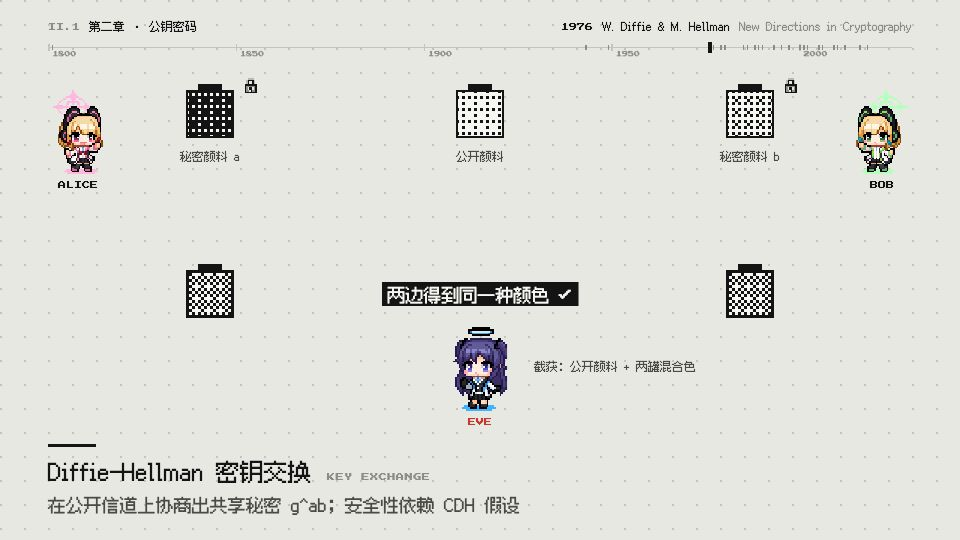
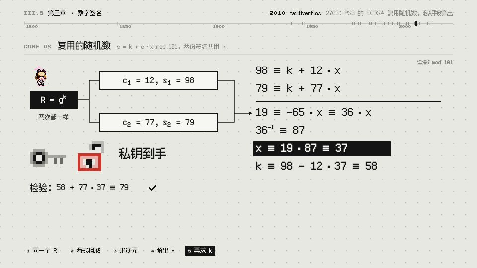
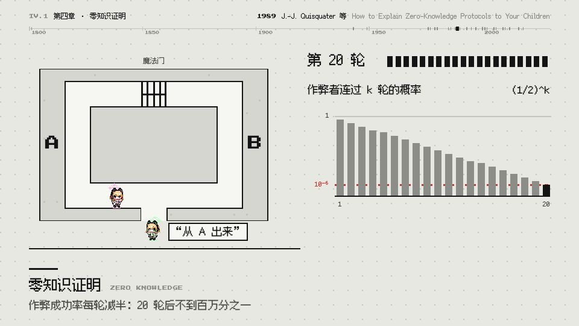
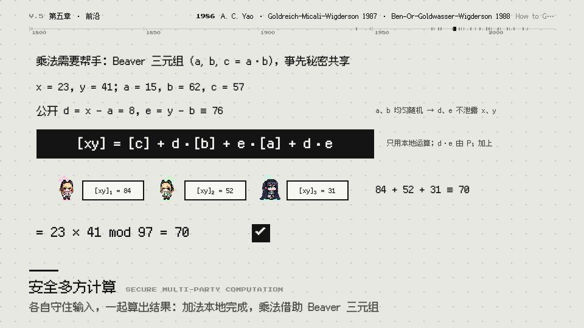
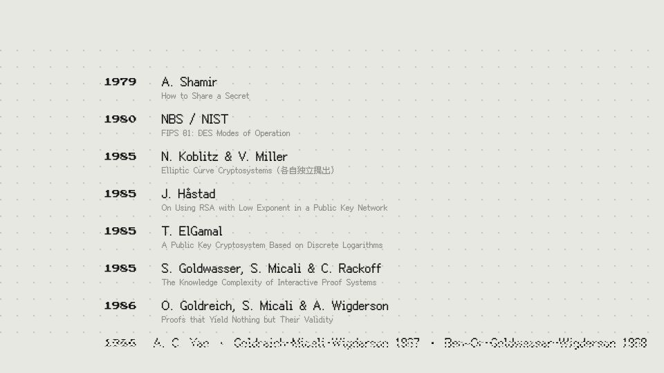
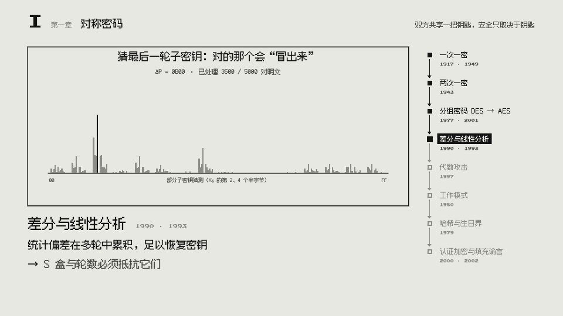
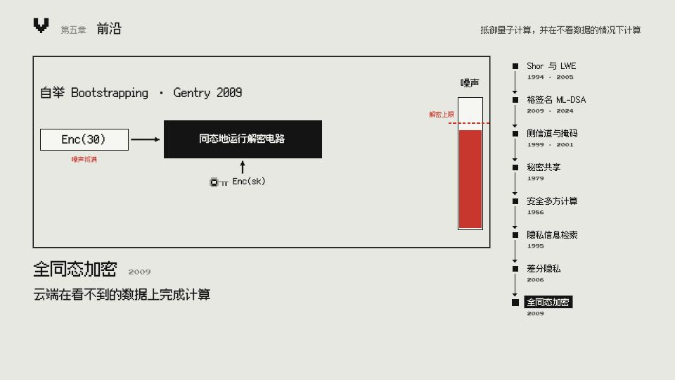

# 现代密码学 · MV

一部介绍现代密码学的 Remotion 动画短片：五章、四十余个算法，从香农的完美保密一路讲到后量子密码与隐私计算。
1920×1080 / 60fps，时间轴驱动；一套代码同时出「渲染成片」和「网页实时版」，配乐由脚本按时间轴程序化生成。

画面是灰白黑「纸与墨」的极简像素风，语气是介绍性的编年叙事；每个场景都标注**年份 · 研究者 · 原始论文**。

## 效果预览

| 片头 | 总览 · 密文被"解密"成五块构图 |
|---|---|
|  |  |

| 差分密码分析 | Diffie–Hellman |
|---|---|
|  |  |

| 案例 · nonce 复用 | 零知识洞穴 |
|---|---|
|  |  |

| 安全多方计算 | 致敬名单 |
|---|---|
|  |  |

| 短版 · 来龙去脉链 | 短版 · 章节收尾 |
|---|---|
|  |  |

## 版本

| Composition | 时长 | 人物 | 内容 |
|---|---|---|---|
| `MVCrypto` | ≈ 17 min | 游戏开发部像素人物 | 完整版：五章 · 31 个概念场景 · 10 个经典案例 · 致敬名单 |
| `MVCryptoShort` | ≈ 4:42 | 游戏开发部像素人物 | 短版：独立成篇的总结片 |
| `MVCryptoClassic` | ≈ 17 min | 原版单色像素小人 | 完整版 |
| `MVCryptoShortClassic` | ≈ 4:42 | 原版单色像素小人 | 短版 |

**短版不是截短**：一句问题开场，然后五章各一条「来龙去脉」链，覆盖全片**所有算法**——
每个节点是 年份 · 名称 · 解决了什么 · 留下了什么问题（引出下一个节点），并嵌入完整版对应场景的实时片段（`Excerpt`）。节点数据在 `src/scenes/short_nodes.ts`。

## 内容（完整版）

| 章 | 内容 |
|---|---|
| 序 | 片头（方块光标打出 `encrypt("hello")` → 密文散落 → 编年旁白 → 标题）· 总览（密文瓷砖被"解密"，归位成五块蒙德里安式构图） |
| I 对称密码 | 一次一密 · AES · **密码分析：差分（Biham–Shamir）· 线性（Matsui）· 代数攻击（Gröbner 基）** · 工作模式 · 认证加密；案例：两次一密、代数攻击、生日界、填充谕言 |
| II 公钥密码 | 循环群与离散对数 · Diffie–Hellman · 椭圆曲线 · TLS 1.3；案例：教科书 RSA、Håstad 广播攻击 |
| III 数字签名 | EUF-CMA · Lamport · Schnorr / Fiat–Shamir · Merkle 树 · BLS；案例：Lamport 密钥复用、nonce 复用 |
| IV 零知识证明 | 零知识洞穴 · 图同构 · Σ 协议 · Sumcheck · SNARK；案例：Fiat–Shamir 的陷阱 |
| V 后量子与隐私计算 | LWE / Kyber · 格签名 ML-DSA · 侧信道与掩码（Goubin 转换）· 安全多方计算 · PIR · 差分隐私 · 全同态加密；案例：Shamir 秘密共享 |
| 尾 | 按年份滚动的致敬名单 → 全景收束成一把锁 → 「守护每一个秘密」 |

所有数值例子（XOR、S 盒差分 / 线性表、Gröbner 基、RSA、CRT、Schnorr 提取、Sumcheck、LWE、Beaver 乘法、Goubin 仿射性……）都在场景代码里计算，不是写死的结果。

## 工程结构

```
src/
  Root.tsx Main.tsx       四个 Composition（variant: full / short × cast: ba / classic）
  timeline.ts             镜头表：五章的场景、节奏档位、短版结构；自动计算真实时长与音效时刻
  cites.ts                每个场景的 {year, who, work}、各章里程碑、案例编号顺序
  theme.ts                纸与墨的配色 token、像素字体、6px 网格、缓动与量化工具
  components/             Shot（转场 + 时间映射）· ui（页眉 / 旁白 / 年代标尺）· Problem（案例页）
                          ActTitle（章标题）· pixel（像素面板 / 精灵 / 方块光标 / 抖动）· kit · Excerpt
  scenes/                 sym* · pk* · sig* · zk* · fr* · short* · Intro · Overview · fin
web/                      网页实时版（Remotion Player，可切换完整版 / 短版、两套人物）
audio/make_music.py       8-bit 配乐生成；audio/timeline*.json 为导出的时间轴（可再生）
scripts/                  时间轴导出 · 静帧 / 拼图 · 批量渲染 · 符号字体生成 · 字形检查
public/                   渲染用静态资源（字体、人物精灵、配乐 mp3）
web-public/               网页版静态资源
assets/screenshots/       README 截图
```

### 节奏：有轻重

`timeline.ts` 为每个镜头设档位：A 核心 0.75× · B 标准 0.88× · C 利落 1.0× · 章标题 0.67× · 首尾 0.85×；
每个场景最多 3 个关键时刻（`reveal` / `bell` / `chime` cue）自动放慢到 0.4×，让结论停得住。
场景按「场景帧」编写，`useF()` 返回映射后的场景帧；镜头真实时长自动计算并取整到整小节（120 帧 = 120 BPM 下 1 小节）。

### 视觉约定

只用 `COL.*` 语义色（纸、墨、灰阶，唯一强调色是表示攻击 / 错误的红）；无渐变、模糊、圆角、半透明；坐标对齐 6px 网格；
全部像素字体（中文 Fusion Pixel、英文标签 Press Start 2P，以及 `scripts/make_symbol_font.py` 生成的符号补充字体 Crypto Pixel：⊕ ≡ ≠ ≤ ∈ √ ∑ ⌊⌋ 𝔽 ℤ 等）；
光标一律是方块 █。`scripts/check_glyphs.py` 检查源码里是否有字体画不出的字符。画面上不出现任何具体课程名。

## 人物

| 角色 | 人物（`cast: 'ba'`） |
|---|---|
| Alice | 才羽桃井 |
| Bob | 才羽绿 |
| Eve（窃听者 / 攻击者） | 早濑优香 |
| 研究者 / 挑战者 / 验证者 | 天童爱丽丝 |

人物精灵取自 pixiv #95092393（"Game Development Department" 像素立绘），按原生分辨率（3× 像素网格）裁切、去背景，
嵌入在 `src/components/sprites_data.ts`（源图 `public/sprites/`）。Alice 面向右、Bob 面向左，其余角色面向画面中心（`SpriteG` 自动镜像，场景可用 `face` 覆盖）。
**该图为他人作品，公开发布前请取得作者授权并署名**；`cast: 'classic'` 的两个版本使用原版单色像素小人，不含该素材。

## 配乐：8-bit《卡农》

`audio/make_music.py`：Pachelbel《D 大调卡农》（公有领域）的 8-bit 编配。三角波奏固定低音 D–A–B–F♯–G–D–G–A，
三路方波（占空比 25 / 50 / 12.5%）严格卡农、依次进入，按原曲顺序演奏旋律变奏（二分音符下行线 → 八分音符 → 十六分音符音阶 → 快速经过句），噪声通道作鼓。

- **整部片只有一条连续的卡农**：段落之间只改变密度（声部数、鼓、和声、音量，逐小节平滑），旋律从不被切断重来；
- 各章升调（D → E → F♯ → G → A → D），转调落在固定低音的周期边界，前一小节用一段音阶变奏作桥，低音转到新调属音；
- 场景里的 cue 映射为芯片音效（打字、提示、揭晓……），片尾以 G–A–D 终止。

## 快速开始

```bash
npm install
npm run studio          # Remotion Studio 预览
npm run web:dev         # 网页实时版
```

配乐（需要 Python）：

```bash
python3 -m venv .venv && .venv/bin/pip install numpy scipy soundfile fonttools brotli
npm run music           # 导出两版时间轴并生成 public/music.wav、public/music_short.wav
npm run audio:mp3       # 转出 mp3（网页版用）
```

## 渲染

```bash
bash scripts/render_all.sh                    # 四个版本 → out/Crypto_MV_{short,full}{,_classic}.mp4
npm run render                                # 仅完整版
npm run render:short                          # 仅短版
bash scripts/sheet.sh name sym_diff:300 pk_dh:350   # 按「镜头:场景帧」渲染静帧并拼图到 out/name.jpg
```

渲染配置在 `remotion.config.ts`（h264 / crf 17 / yuv420p / jpeg 92，并发 8）。本地渲染前先 `npm run music` 生成 `public/*.wav`（母带不进仓库）。

## 不进仓库的内容

`node_modules/`、`.venv/`、`out/`（成片与静帧）、`dist/`、`public/*.wav`（配乐母带，可再生）。
